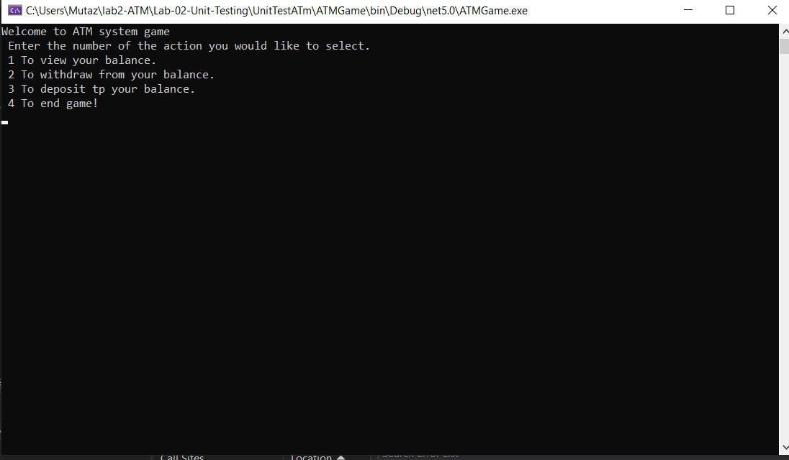
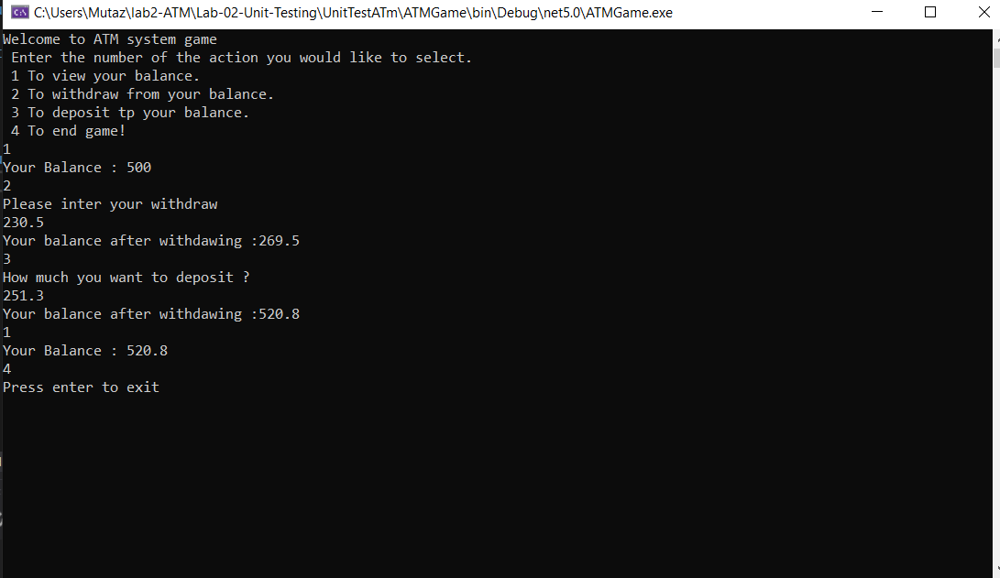
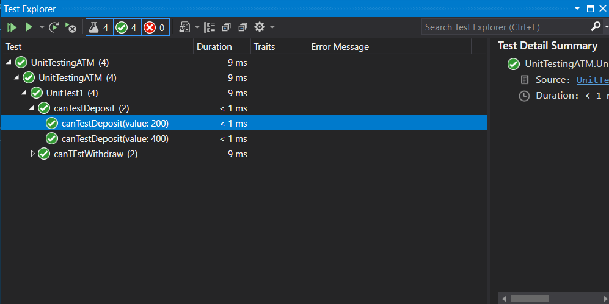

# Lab-02-Unit-Testing

## Description
This is a C# console app that simulates an ATM machine and lets the user interactively perform standard ATM operations such as view balance and withdraw funds. The user will also be able to do other mock ATM operations like add/deposit money. It anticipates and handles a variety of exceptions and was built using TDD principles.

---

## Application steps

 1. press 1 to show your balnce. 
 2. Press 2 to withdraw from your balance.
 3. Press 3 to deposit into your balance.
 4. Press 4 to end the program.

---

## Visuals

